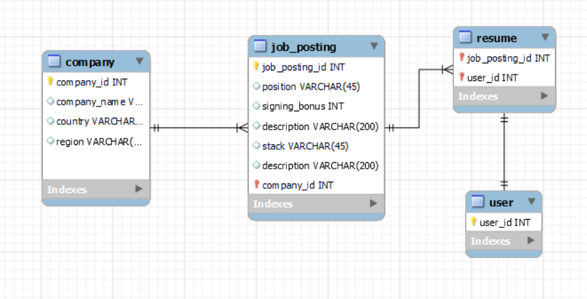

# wanted_pre_onboarding

wanted 프리온보딩 백엔드 코스 선발과제 입니다.

- [과제 링크](https://bow-hair-db3.notion.site/5-1850bca26fda4e0ca1410df270c03409)
- Node.js로 API 서버 구현
- 서비스 개요 및 요구사항을 만족하는 API 서버를 구현합니다.

## 필수 기술요건

- ORM 사용하여 구현.
- RDBMS 사용 (SQLite, PostgreSQL 등).

## 서비스 개요

- 본 서비스는 기업의 채용을 위한 웹 서비스 입니다.
- 회사는 채용공고를 생성하고, 이에 사용자는 지원합니다.

## ERD

## 기술 스택

- Sequelize + Express + MySQL
- (+ Jest) : 테스팅을 하게 된다면 러닝커브가 낮고 자료가 많은 Jest를 사용할 예정

## TO_DO_LIST

**요구사항은 아니지만 있으면 편할 기능**

- [x] 회사 등록
- [ ] 사용자 등록

**필수 요구사항**

- [x] 회사(company) 모델 만들기
- [x] 채용공고(JobPost) 모델 만들기
- [x] 유저(User) 모델 만들기
- [x] 이력서(Resume) 모델 만들기

- [x] 회사 - 채용공고 연관관계 설정
- [ ] 유저 - 이력서 연관관계 설정
- [ ] 이력서 - 채용공고 연관관계 설정

- [x] 채용 공고 등록 (C)
- [ ] 채용 공고 수정 (U)
- [ ] 채용 공고 삭제 (D)
- [ ] 채용 공고 목록 읽기 (R : Find All)
- [ ] 채용 상세 페이지 읽기 (R : Find By Id)

**선택 사항**

- [ ] 채용 공고 검색 기능
- [ ] 채용 상세 페이지에서 회사가 올린 다른 채용 공고 추가
