# wanted_pre_onboarding

wanted 프리온보딩 백엔드 코스 선발과제 입니다.

- [과제 링크](https://bow-hair-db3.notion.site/5-1850bca26fda4e0ca1410df270c03409)
- Node.js로 API 서버 구현
- 서비스 개요 및 요구사항을 만족하는 API 서버를 구현합니다.

---

## 필수 기술요건

- ORM 사용하여 구현 - **Sequelize**
- RDBMS 사용 - **MySQL**

---

## 서비스 개요

- 본 서비스는 기업의 채용을 위한 웹 서비스 입니다.
- 회사는 채용공고를 생성하고, 이에 사용자는 지원합니다.

---

## ERD

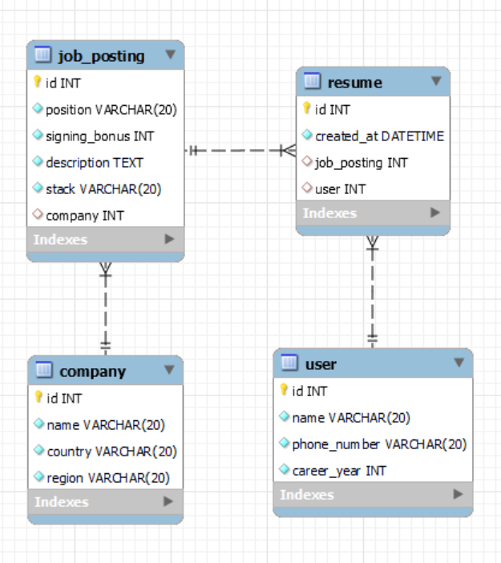

---

## API DOCS - PostMan

[API DOCS 링크](https://documenter.getpostman.com/view/21185842/2s847JtYHt)

- https://documenter.getpostman.com/view/21185842/2s847JtYHt

---

## 기술 스택

- Sequelize + Express + MySQL

---

## TO_DO_LIST

**요구사항은 아니지만 있으면 편할 기능**

- [x] 회사 등록
- [x] 사용자 등록

**필수 요구사항**

모델링

- [x] 회사(company) 모델 만들기
- [x] 채용공고(JobPost) 모델 만들기
- [x] 사용자(User) 모델 만들기
- [x] 이력서(Resume) 모델 만들기

연관관계 매핑

- [x] 회사 - 채용공고 연관관계 설정
- [x] 사용자 - 이력서 연관관계 설정
- [x] 이력서 - 채용공고 연관관계 설정

CRUD 구현 (API + ORM)

- [x] 채용 공고 등록 (C)
- [x] 채용 공고 수정 (U)
- [x] 채용 공고 삭제 (D)
- [x] 채용 공고 목록 읽기 (R : Find All)
- [x] 채용 상세 페이지 읽기 (R : Find By Id)

**선택 사항**

- [x] 채용 공고 검색 기능
- [x] 채용 상세 페이지에서 회사가 올린 다른 채용 공고 추가
- [x] 사용자 채용 공고 지원

**문서 정리**

- [x] README 정리
- [x] ERD 최종본 만들기
- [x] POSTMAN DOCS 만들기
- [x] 구현 화면 캡처 정리

---

## 구현 캡처

**00. Sequelize로 테이블 생성**

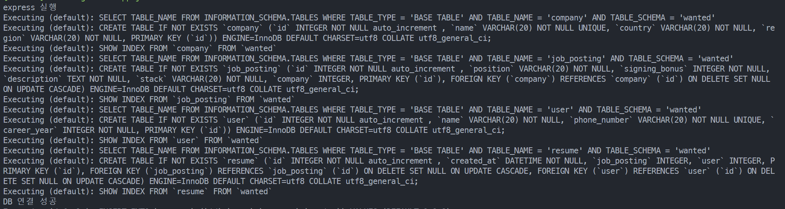

**01. 회사 등록**

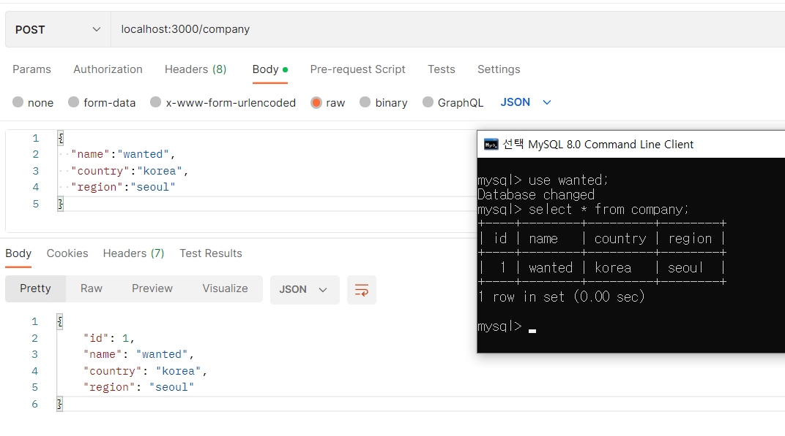

**02. 채용공고 등록**

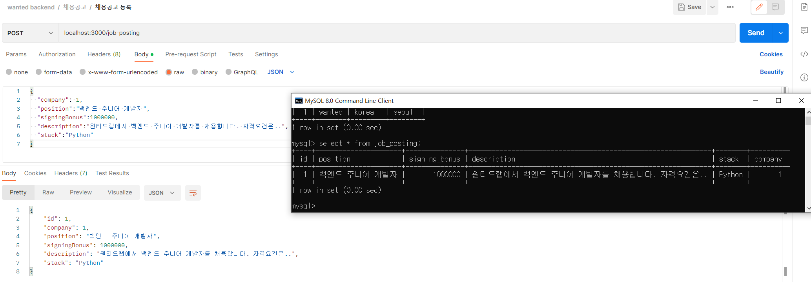

**03. 채용공고 삭제**

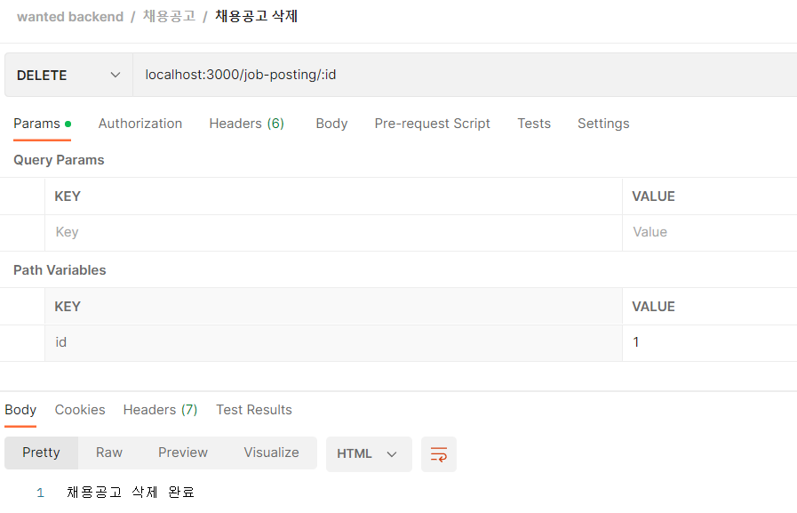

**04. 채용공고 삭제 - 실패시**

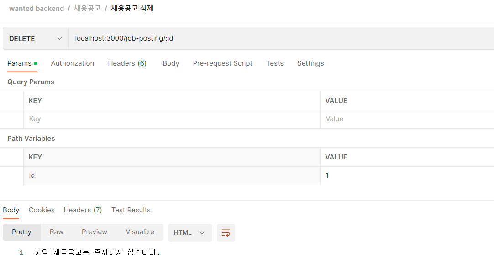

**05. 채용공고 전체 읽기**

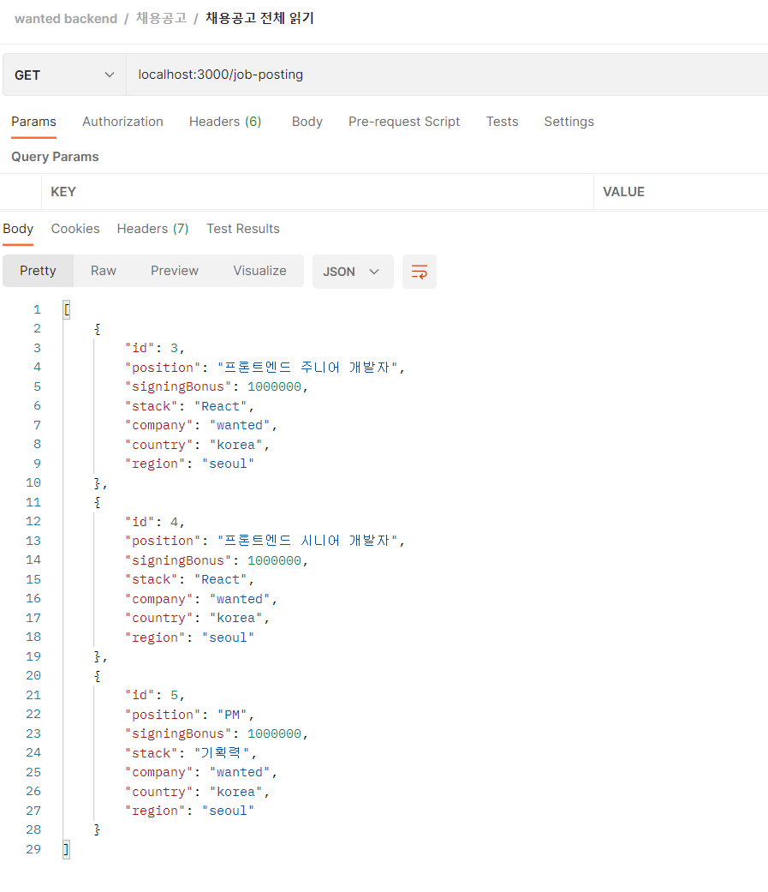

**06. 채용공고 상세 페이지 읽기**

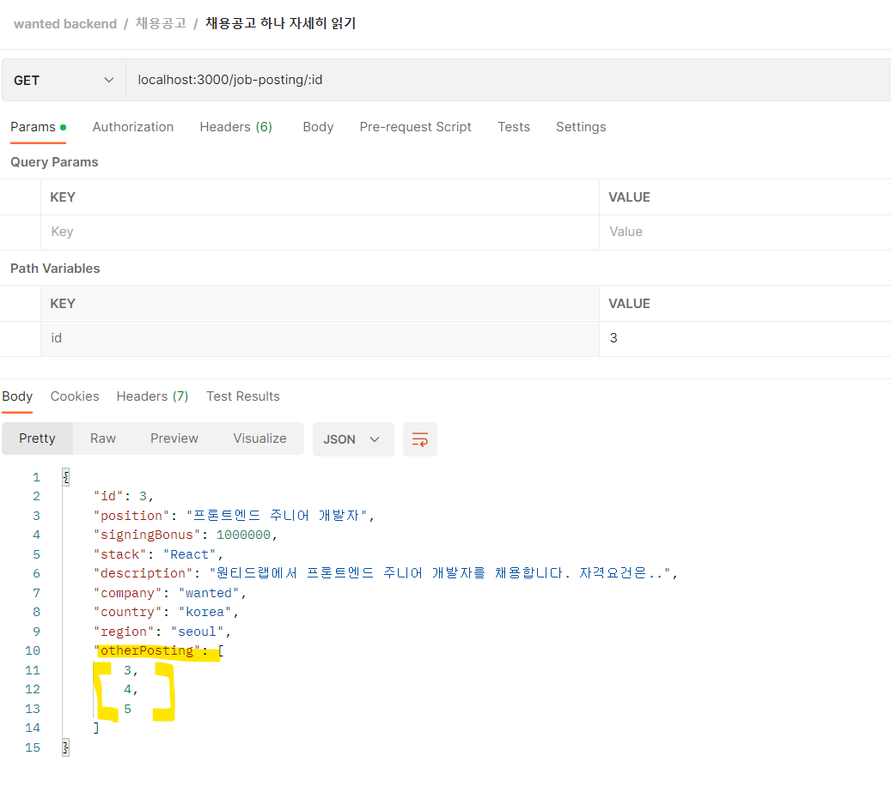

**07. 채용공고 상세 페이지 읽기 - 실패시**

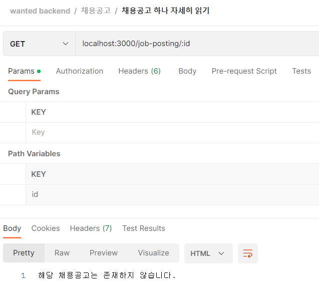

**08. 채용공고 수정**

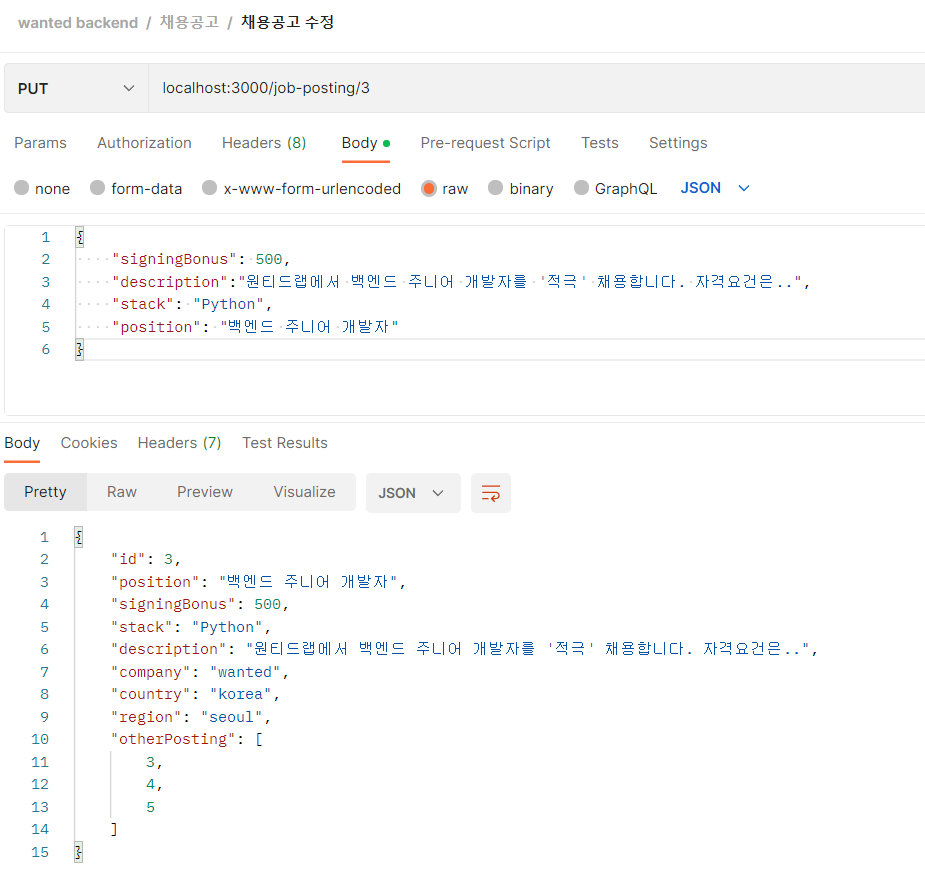

**09. 채용공고 검색 기능**

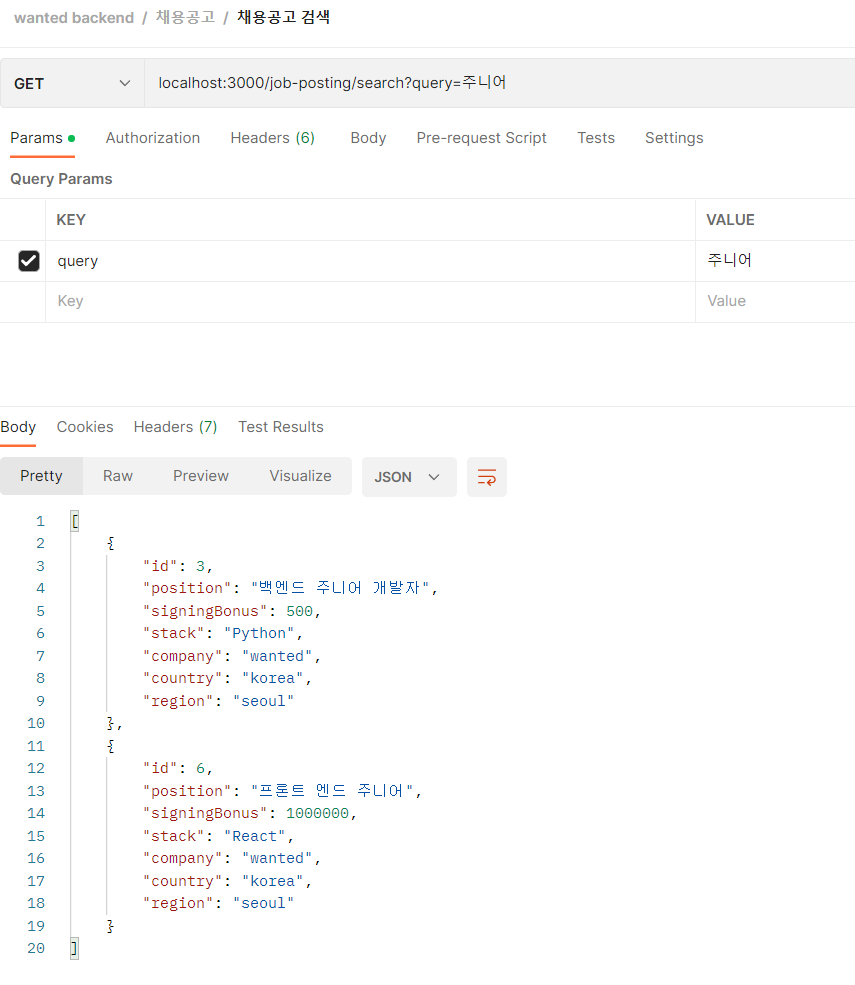
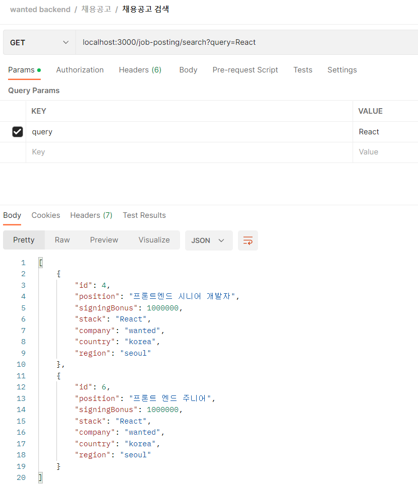

**10. 유저 등록**

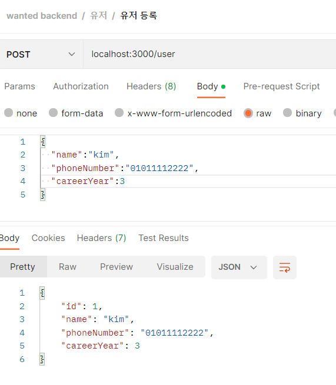

**11. 유저가 채용공고 지원**

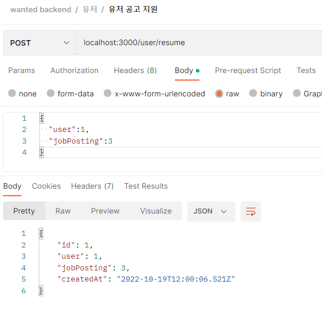

**12. 유저가 채용공고를 두 번 지원 (실패)**

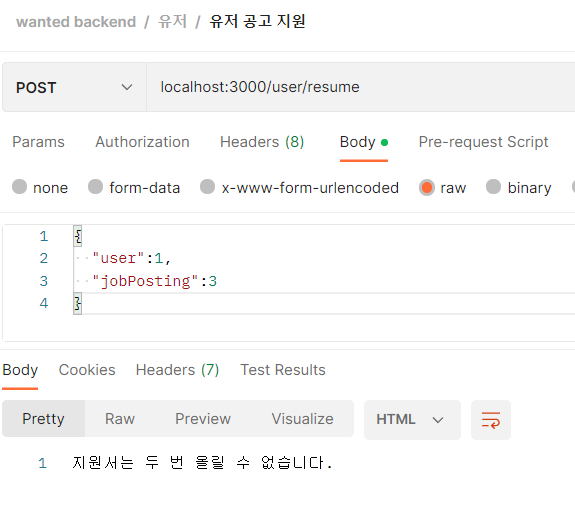
